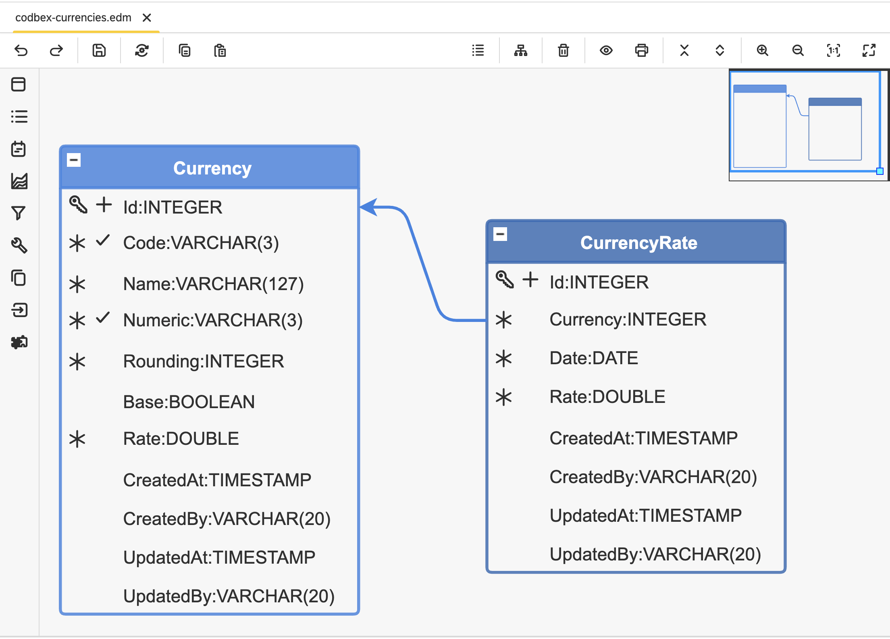

#  codbex-currencies

## 📖 Table of Contents
* [🗺️ Entity Data Model (EDM)](#️-entity-data-model-edm)
* [🧩 Core Entities](#-core-entities)
* [🔗 Sample Data Modules](#-sample-data-modules)
* [🐳 Local Development with Docker](#-local-development-with-docker)

## 🗺️ Entity Data Model (EDM)



## 🧩 Core Entities

### Entity: `Currency`

| Field     | Type       | Details                   | Description                              |
|-----------| ---------- |---------------------------| ---------------------------------------- |
| Id        | INTEGER    | PK, Identity    | Unique identifier for the currency.      |
| Code      | VARCHAR    | Length: 3, Unique, Not null | Code of the currency (e.g., USD).        |
| Name      | VARCHAR    | Length: 127, Not null     | Name of the currency.                    |
| Numeric  | VARCHAR    | Length: 3, Unique, Not null | Numeric code of the currency.            |
| Rounding  | INTEGER    | Not null                  | Rounding value for the currency.         |
| Base      | BOOLEAN    | Nullable                  | Indicates if this is the base currency.  |
| Rate      | DOUBLE     | Not null                  | Exchange rate of the currency.           |
| CreatedAt | TIMESTAMP  | Audit, Nullable                  | Timestamp when the entry was created. |
| CreatedBy | VARCHAR    | Audit, Length: 20, Nullable      | User who created the entry.           |
| UpdatedAt | TIMESTAMP  | Audit, Nullable                  | Timestamp when the entry was updated. |
| UpdatedBy | VARCHAR    | Audit, Length: 20, Nullable      | User who updated the entry.           |

### Entity: `CurrencyRate`

| Field     | Type       | Details                     | Description                              |
|-----------| ---------- | --------------------------- | ---------------------------------------- |
| Id        | INTEGER    | PK, Identity      | Unique identifier for the currency rate. |
| Currency  | INTEGER    | FK, Not null              | Foreign key referencing the currency.    |
| Date      | DATE       | Not null                 | Date of the currency rate.               |
| Rate      | DOUBLE     | Not null            | Exchange rate value.                     |
| CreatedAt | TIMESTAMP  | Audit, Nullable                    | Timestamp when the entry was created.     |
| CreatedBy | VARCHAR    | Audit, Length: 20, Nullable        | User who created the entry.               |
| UpdatedAt | TIMESTAMP  | Audit, Nullable                    | Timestamp when the entry was updated.     |
| UpdatedBy | VARCHAR    | Audit, Length: 20, Nullable        | User who updated the entry.               |

## 🔗 Sample Data Modules

- [codbex-currencies-data](https://github.com/codbex/codbex-currencies-data)

## 🐳 Local Development with Docker

When running this project inside the codbex Atlas Docker image, you must provide authentication for installing dependencies from GitHub Packages.
1. Create a GitHub Personal Access Token (PAT) with `read:packages` scope.
2. Pass `NPM_TOKEN` to the Docker container:

    ```
    docker run \
    -e NPM_TOKEN=<your_github_token> \
    --rm -p 80:80 \
    ghcr.io/codbex/codbex-atlas:latest
    ```

⚠️ **Notes**
- The `NPM_TOKEN` must be available at container runtime.
- This is required even for public packages hosted on GitHub Packages.
- Never bake the token into the Docker image or commit it to source control.
